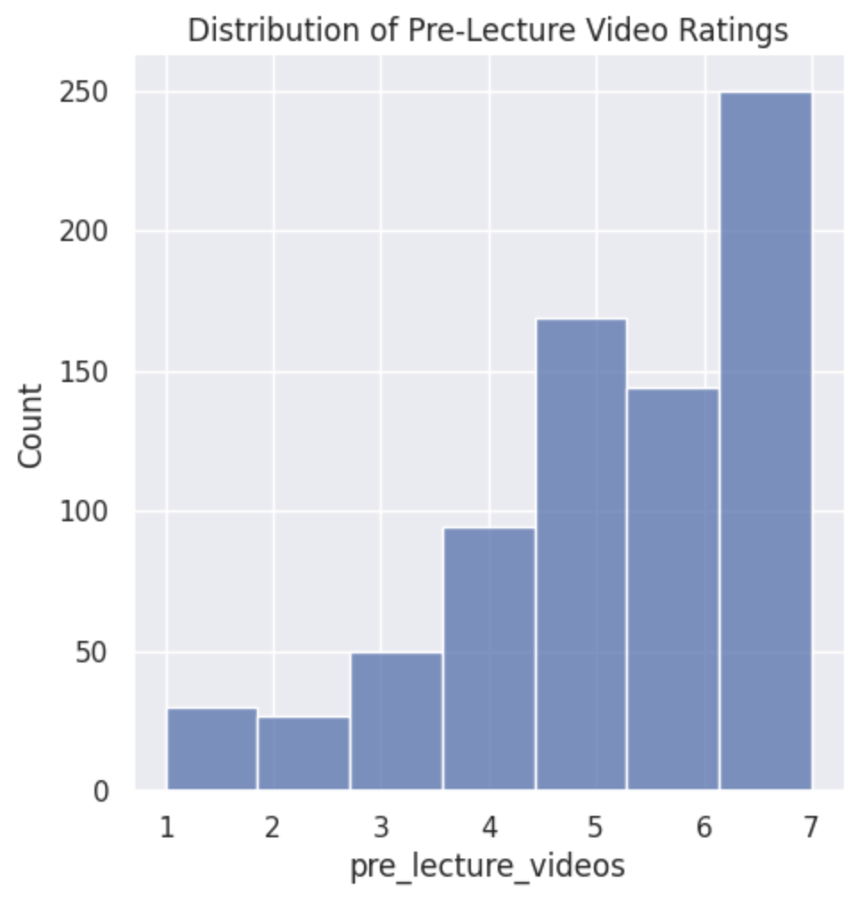
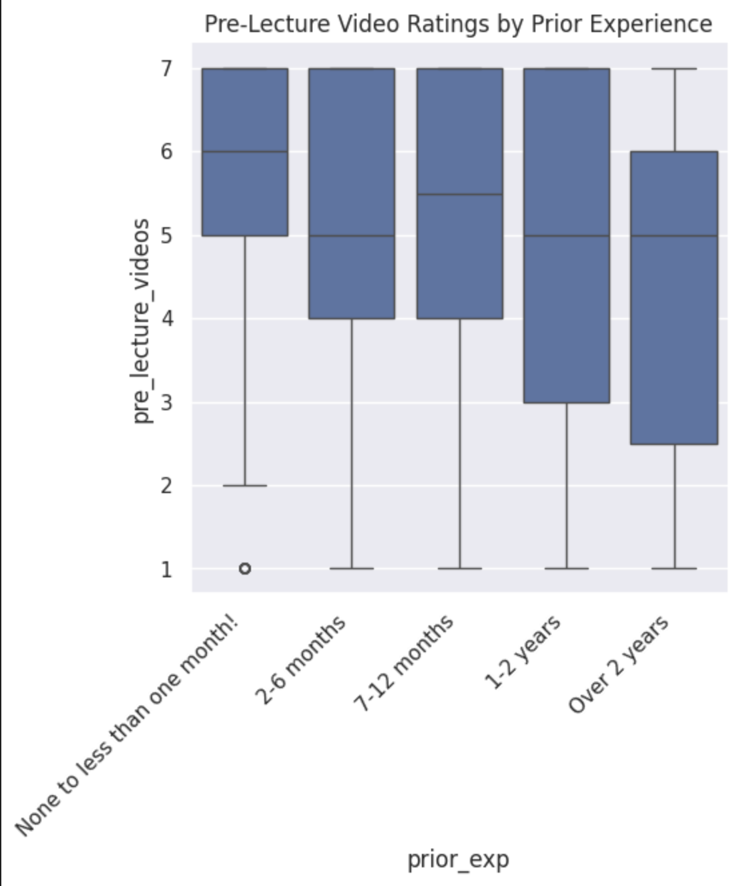
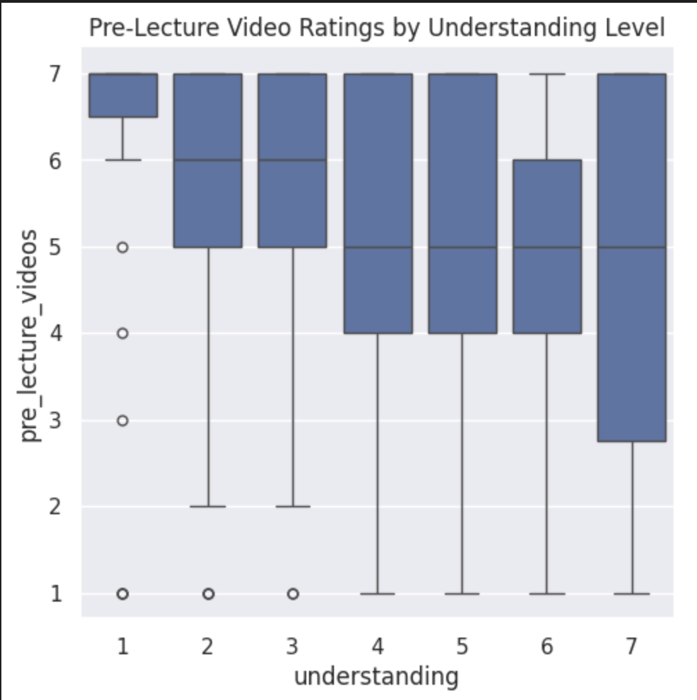

# COMP 110 Data Analysis: Pre-Lecture Videos

## Summary
For this project I analyzed whether students in COMP 110 would find pre-recorded lecture videos helpful. I used survey data collected from two sections of COMP 110 to explore this idea.

## Analysis

I wanted to figure out if students in COMP 110 actually want pre-recorded lecture videos, and if students who are struggling more tend to want them more than students who already feel like they get it.

I used survey data from both sections of COMP 110 and combined them into one big dataset. Then I looked at the pre_lecture_videos column, where students rated 1-7 whether they'd find videos helpful before each lecture.

First I just counted how many students gave each rating. Most people rated it a 6 or 7 which was pretty surprising as basically the whole class wants this.

Then I compared ratings based on how much prior coding experience students had. Students with no experience rated it the highest, which makes sense because they probably feel the most lost and would benefit most from being able to rewatch stuff. Students with over 2 years of experience rated it lower since they already know what they're doing.

Last I looked at whether students who feel like they understand less of the course rated videos higher. Students who gave themselves a 1 for understanding had really high video ratings, while students who felt like they understood everything had more mixed opinions about it.

## Visualizations

## Conclusion

The data pretty clearly supports adding pre-lecture videos to COMP 110. Almost everyone rated it a 6 or 7, and the students who felt the most lost in the course wanted them the most. That makes a lot of sense to me — if you could watch a short video before class, you'd at least have some idea of what's going on when the professor starts explaining it instead of feeling completely lost from the start.

The main downside is that making videos for every single topic is a lot of work for the instructors. There's also a risk that students would just watch the video and skip lecture, which would be bad. But I think if the videos were kept short and just introduced the concept without going too deep, students would still have a reason to show up to class.

It would also be cool to look at whether students who already go find outside videos on YouTube for help tend to do better in the course, because that would be even more evidence that having video content available actually makes a difference.